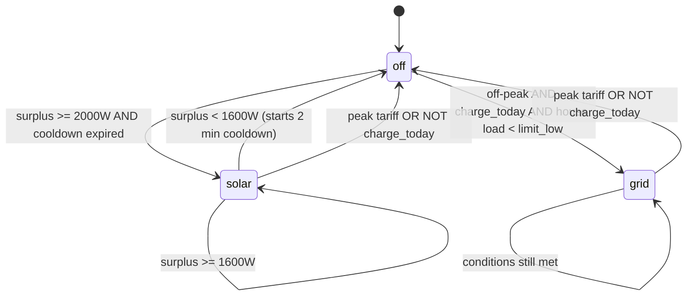

# EV Charger — Solar + Grid Load Balancing (Home Assistant)

Home Assistant automation that charges an electric vehicle, prioritizing
solar surplus, with a fallback to off-peak grid charging (bi-hourly
tariff), overload protection for the installation, and hysteresis with a
cooldown to prevent the charger's relay from flapping.

Built for a setup with solar panels + a Tesla Powerwall 2 battery, but the
logic is generic and adaptable to any inverter/EVSE that exposes the
equivalent sensors.

## Table of contents

- [How it works](#how-it-works)
- [Requirements](#requirements)
- [Entities used](#entities-used)
- [Installation](#installation)
- [Configuration variables](#configuration-variables)
- [Known limitations](#known-limitations)
- [License](#license)

## How it works

The automation runs every **8 seconds** and evaluates 4 decision blocks,
in priority order. Each block, when it acts, stops execution for that
cycle (the following blocks aren't evaluated) — except when exiting solar
mode due to insufficient surplus, in which case execution falls through
to the next block in the same cycle, allowing a direct transition to grid
mode without turning the charger off.

Overload (block 1) is transversal: it can reduce or cut current in any of
the three modes, whenever total house consumption or grid import reaches
the critical limit.

### 1. Overload (installation protection)

If `house_total_w >= max_total_power` or `grid_import_w >= max_grid_power`:
reduces current in `step_down_amps` steps; if already at the minimum,
turns the charger off. Always runs first, regardless of the current mode.

### 2. Solar mode (with hysteresis and cooldown)

- **Enters** solar mode when solar surplus (`solar_excess_w`) reaches
  `solar_on_threshold_w` (2000W) — as long as the re-entry cooldown isn't
  active.
- **Stays** in solar mode as long as the surplus doesn't drop below
  `solar_off_threshold_w` (1600W) — this hysteresis band prevents
  repeated on/off switching when the surplus oscillates near the
  threshold.
- **Exits** solar mode when the surplus drops below 1600W: resets the
  state, starts `timer.ev_solar_cooldown` (2 min by default), and only
  attempts to re-enter solar mode after the timer expires — even if the
  surplus recovers in the meantime.
- Current adjusts dynamically to the available surplus
  (`solar_target_amps`), ramping up in `step_up_amps` steps and down in
  `step_down_amps` steps.

### 3. Blocked (peak tariff / charging not authorized)

If the tariff is in peak hours (`energy_expensive`) **or** today's
charging isn't authorized (`not charge_today`): turns the charger off
explicitly. This block takes priority over grid mode, but **not** over
solar mode — solar surplus is still used even during peak hours.

### 4. Cheap grid mode

Outside peak hours, with charging authorized today and with headroom in
house consumption (`house_total_w` and `grid_import_w` below
`limit_low`): turns the charger on and ramps current up in
`step_up_amps` steps toward the maximum.

## Requirements

- Home Assistant **2024.10+** (uses the `if`/`then` action syntax,
  available from that version onward)
- An EV charger controllable from Home Assistant with:
  - a `switch` to turn it on/off
  - a `number` to set the charging current
- Solar production sensor (W)
- Total house consumption sensor (W), including the charger itself
- A sensor for the charger's own consumption (e.g., via a Shelly EM)
- Grid power sensor (positive = importing, negative = exporting)
- Battery power sensor, if present (positive = charging) — used so
  battery charging isn't counted as available surplus
- An `input_boolean` indicating peak-tariff hours
- An `input_boolean` authorizing/blocking charging for the day

## Entities used

⚠️ The IDs below are specific to the original installation — replace them
with your own before importing.

| Entity | Role |
|---|---|
| `switch.ev_charger_rfid` | Turns the charger on/off |
| `number.ev_charger_set_charge_current` | Charging current (A) |
| `sensor.solar_power` | Instantaneous solar production (W) |
| `sensor.geral_casa_garagem_power` | Total house consumption, including the charger (W) |
| `sensor.shellyem_48e729689cd1_channel_1_power` | Charger's own consumption (W) |
| `sensor.rede_power` | Grid power — positive = importing (W) |
| `sensor.bateria_power` | Battery power — positive = charging (W) |
| `input_boolean.custo_energia` | `on` = peak-tariff hours |
| `input_boolean.ev_charge_today` | `on` = charging authorized today |
| `input_select.ev_charge_mode` | Helper — current state: `off` / `solar` / `grid` |
| `timer.ev_solar_cooldown` | Helper — solar mode re-entry cooldown |

## Installation

1. **Create the helpers first** — see [`helpers.yaml`](./helpers.yaml).
   They can't be created from the automation itself; use
   `configuration.yaml` + restart, or Settings → Devices & Services →
   Helpers → + Add Helper (Dropdown for the `input_select`, Timer for the
   `timer`).
2. Replace the `entity_id`s in
   [`ev_charger_automation.yaml`](./ev_charger_automation.yaml) with the
   ones from your own setup.
3. Adjust the [configuration variables](#configuration-variables) to your
   own values (contracted power, charger's min/max current, etc.).
4. Import the automation: Settings → Automations → + Add Automation →
   Edit in YAML, paste the content, and save.
5. Validate the YAML before applying it in production (`yaml.safe_load`
   in Python, or the HA editor's built-in validator).

## Configuration variables

| Variable | Example value | Meaning |
|---|---|---|
| `voltage` | 230 | Installation voltage (V), used to convert W ↔ A |
| `max_amps` | 20 | Charger's maximum current (A) |
| `min_amps` | 8 | Charger's minimum supported current (A) — **confirm your equipment's actual value** |
| `step_up_amps` | 1 | Current increment per cycle when ramping up |
| `step_down_amps` | 3 | Current decrement per cycle when ramping down (more aggressive, for safety) |
| `max_total_power` / `max_grid_power` / `max_power` | 6900 | Contracted power limit (W) — overload cutoff point |
| `safety_margin` | 600 | Margin subtracted from `max_power` to compute `limit_low` |
| `limit_low` | `max_power - safety_margin` | Consumption ceiling below which grid mode keeps ramping current up |
| `solar_on_threshold_w` | 2000 | Minimum surplus to **enter** solar mode |
| `solar_off_threshold_w` | 1600 | Minimum surplus to **stay** in solar mode (hysteresis) |
| `timer.ev_solar_cooldown` duration | 2 min | Wait time before retrying solar mode after exiting due to insufficient surplus |

## Known limitations

- **No active ramp-down in grid mode**: if house consumption rises into
  the zone between `limit_low` and `max_power` while in grid mode, the
  automation pauses ramping current up but doesn't actively reduce it.
  Only the overload block (at the upper limit) intervenes. On an
  installation that regularly sits close to its contracted limit, this
  can lead to abrupt overload cuts instead of a smooth, earlier
  reduction.
- **No equivalent cooldown in grid mode**: the transition to/from grid
  mode has no hysteresis — it depends only on the instantaneous tariff
  and house consumption state each 8-second cycle.

## License

Pick whichever license you prefer for your repository (e.g. MIT) — this
project doesn't include one by default.
